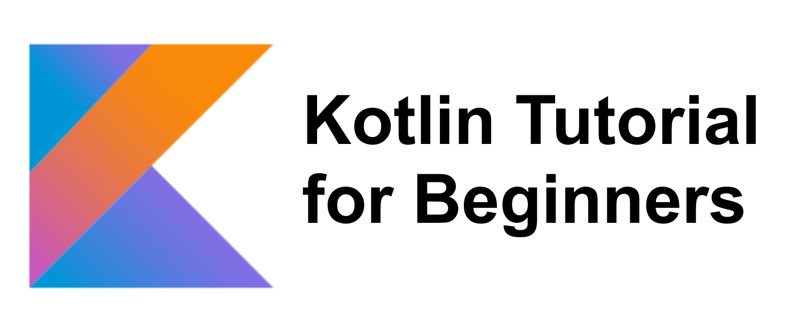

## Topics

* [Data Types and Variables](https://github.com/okanaydin/KotlinTutorial/tree/master/src/DataTypesandVariables)
    * [Data Types and Variables](https://github.com/okanaydin/KotlinTutorial/blob/master/src/DataTypesandVariables/Variables.kt)
    * [Comments](https://github.com/okanaydin/KotlinTutorial/blob/master/src/DataTypesandVariables/Comments.kt)
    
   
* [Control Flow Statements](https://github.com/okanaydin/KotlinTutorial/tree/master/src/ControlFlowStatements) 
    * [if-else Expressions](https://github.com/okanaydin/KotlinTutorial/blob/master/src/ControlFlowStatements/IfElse.kt)
    * [WHEN Expressions](https://github.com/okanaydin/KotlinTutorial/blob/master/src/ControlFlowStatements/WhenExpression.kt)
    * [Ranges](https://github.com/okanaydin/KotlinTutorial/blob/master/src/ControlFlowStatements/Ranges.kt)
    
* [Loop Control Statements](https://github.com/okanaydin/KotlinTutorial/tree/master/src/LoopControlStatements)
    * [FOR Loop](https://github.com/okanaydin/KotlinTutorial/blob/master/src/LoopControlStatements/ForLoop.kt)
    * [WHILE Loop](https://github.com/okanaydin/KotlinTutorial/blob/master/src/LoopControlStatements/WhileLoop.kt)
    * [DO-WHILE Loop](https://github.com/okanaydin/KotlinTutorial/blob/master/src/LoopControlStatements/DoWhileLoop.kt)
    * [BREAK statements](https://github.com/okanaydin/KotlinTutorial/blob/master/src/LoopControlStatements/BreakKeyword.kt)
    * [CONTINUE keyword](https://github.com/okanaydin/KotlinTutorial/blob/master/src/LoopControlStatements/ContinueKeyword.kt)
 